# ResearchGraph 项目功能演示文档

ResearchGraph 是一个面向科研阅读、文献管理和团队协作的知识图谱系统。项目围绕“论文 - 笔记 - 概念 - AI 分析 - 协作任务 - 知识图谱”构建统一的数据闭环，帮助用户把分散的文献阅读过程沉淀为可检索、可关联、可分析、可协作和可视化的研究知识网络。

本文档用于介绍当前 ResearchGraph 项目的主要功能模块，并结合演示截图说明系统能力。

## 1. 项目定位

传统文献管理工具通常侧重于保存论文条目、BibTeX 引用和附件，而 ResearchGraph 更关注科研阅读过程中持续产生的结构化信息：

- 论文元数据：标题、作者、会议/期刊、年份、标签、摘要、链接和附件。
- 阅读过程：笔记、阅读状态、概念标记、反向链接和相关笔记。
- 知识组织：标签、目录、概念卡片、论文关系和主题聚类。
- AI 辅助：标签推荐、相似论文、关系补边和 Related Work 聚类。
- 团队协作：科研项目、项目成员、阅读任务、负责人和评论。
- 图谱呈现：把论文、作者、标签、笔记、概念、项目、任务和 AI 聚类统一为可交互知识图谱。

系统的核心目标不是简单保存论文，而是把科研阅读活动转化为一个不断增长的研究知识库。

## 2. 系统入口与工作台

ResearchGraph 采用用户登录入口进入系统，登录后用户的项目、任务、Dashboard 和知识图谱请求会关联到当前用户身份。该设计使系统能够支持个人文献管理，也能支持多用户协作场景。

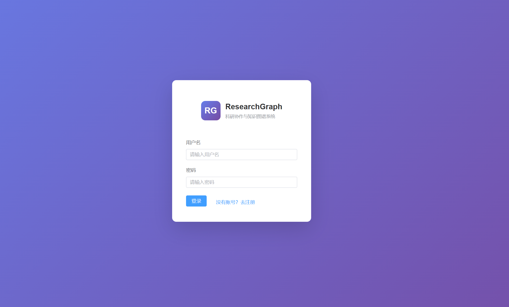

登录后首先进入 Dashboard。Dashboard 是整个系统的科研工作台，用于快速观察当前文献库和协作状态，包括论文数量、笔记数量、项目数量、待完成任务、最近新增论文、最近活动日志、高频标签和快捷入口。

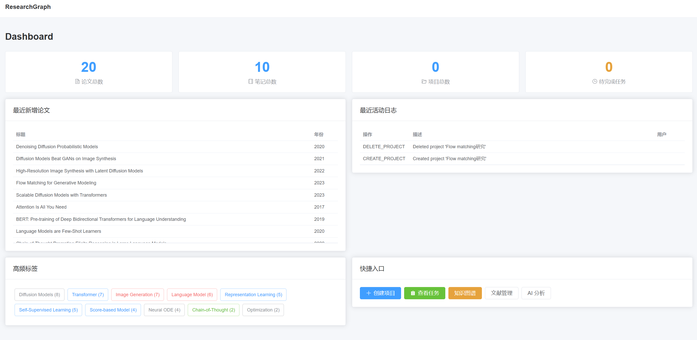

Dashboard 的作用是把各模块产生的数据集中回流到一个总览界面。用户新增论文、创建项目、分配阅读任务或完成协作动作后，都可以在这里看到状态变化。

## 3. 文献管理能力

文献管理是 ResearchGraph 的基础模块。系统支持结构化录入论文信息，并把作者、标签、会议/期刊、阅读状态、摘要、URL 和附件统一维护在数据库中。

### 3.1 论文录入

论文管理页面提供论文列表、搜索筛选和新建入口。用户可以通过新建论文弹窗录入结构化元数据，系统会把作者、标签和来源等信息拆分为独立实体，便于后续检索、统计和图谱构建。

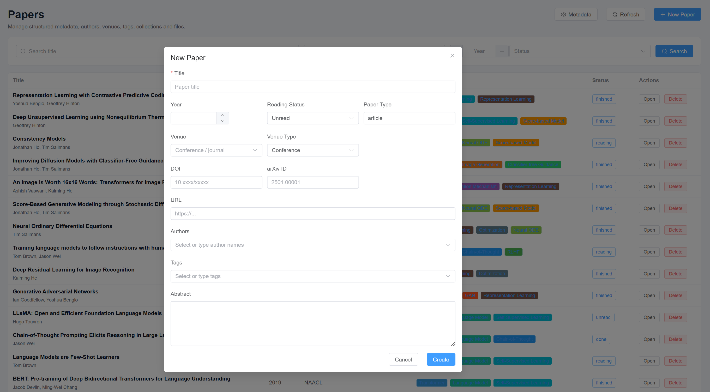

新建论文表单覆盖了科研文献管理中常用的核心字段，包括标题、年份、阅读状态、论文类型、会议/期刊、DOI、arXiv ID、URL、作者、标签和摘要。

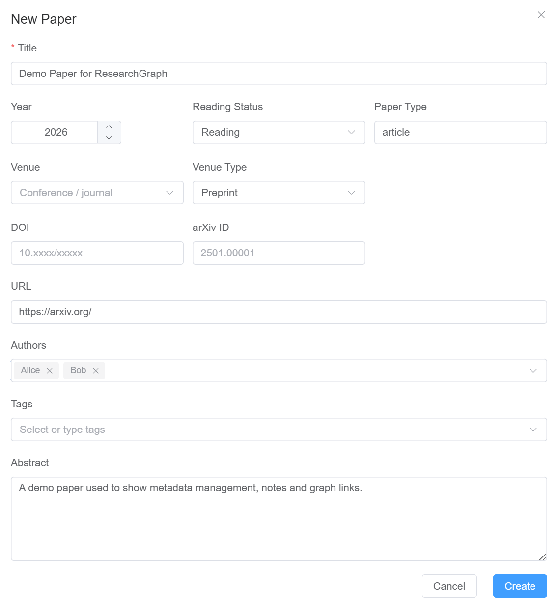

通过结构化录入，系统可以进一步支持按标题、标签、年份和阅读状态筛选论文，也可以把论文自动纳入知识图谱中的论文节点。

### 3.2 元数据与目录管理

ResearchGraph 将标签、会议/期刊和文献目录作为可维护的元数据资源。用户可以在统一页面中新增标签、设置标签颜色、维护会议/期刊来源，并创建文献目录。

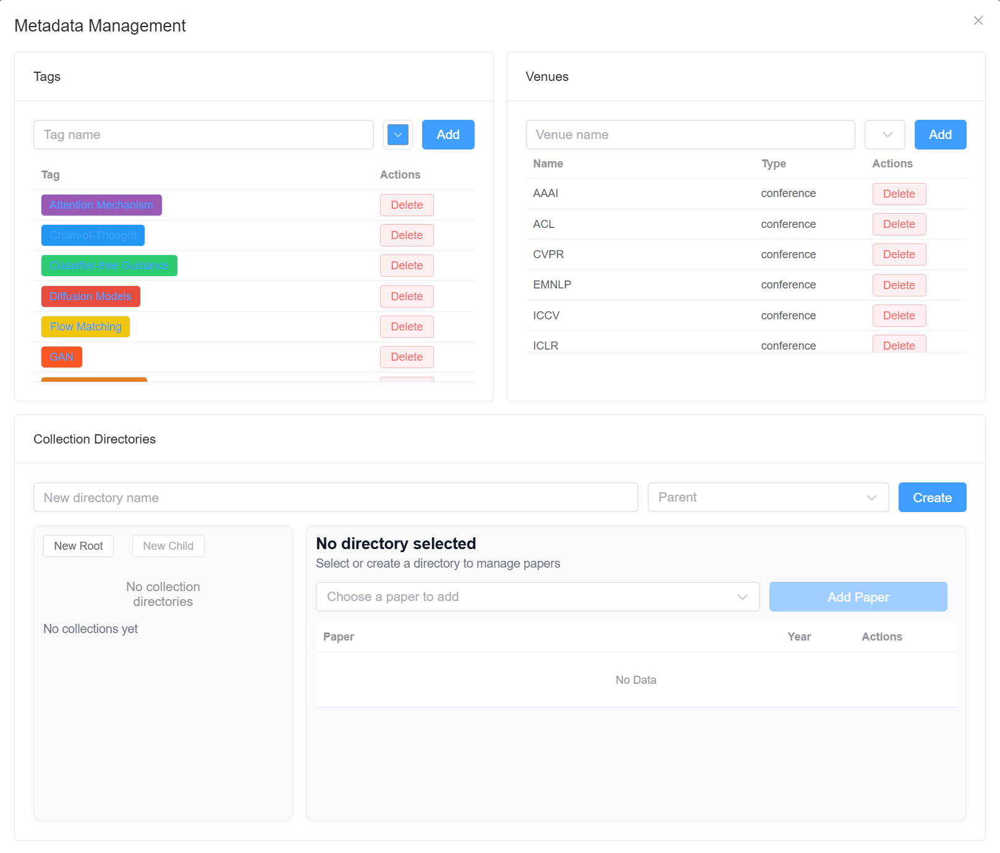

目录管理用于把论文按研究方向、项目主题或阅读计划进行组织。标签负责横向分类，目录负责层级式归档，两者结合可以满足不同的文献组织习惯。

### 3.3 论文详情页

论文详情页汇总展示单篇论文的完整信息。除基础元数据外，还包括标签、所属目录、关联阅读笔记、附件上传区域和 BibTeX 原始条目。

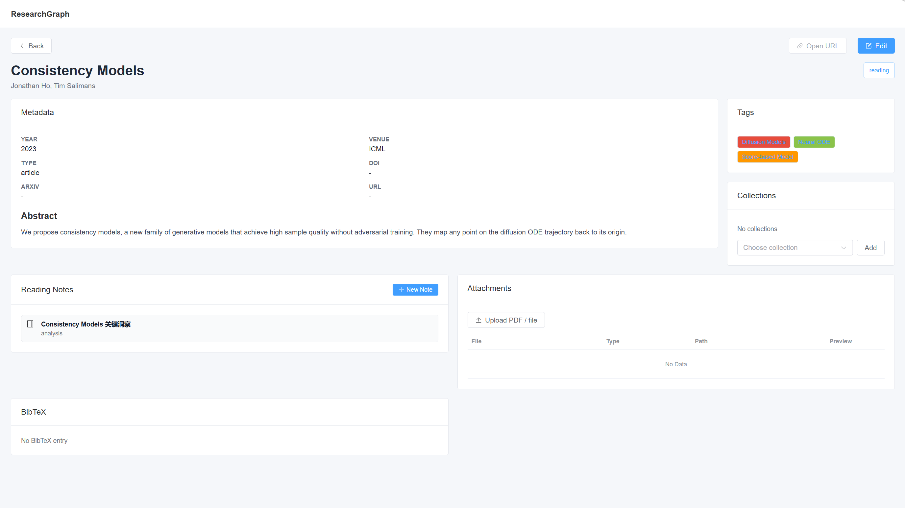

论文详情页是论文和其他模块发生连接的中心：阅读笔记可以从论文详情创建，附件可以挂载到论文，标签和目录可以用于筛选，BibTeX 原文可以保留文献来源信息。

## 4. BibTeX 导入

为了降低手动录入成本，ResearchGraph 提供 BibTeX 导入能力。用户可以粘贴 BibTeX 文本，也可以上传 `.bib` 文件，系统会将外部文献管理格式解析为内部论文、作者、标签、来源和原始引用条目。

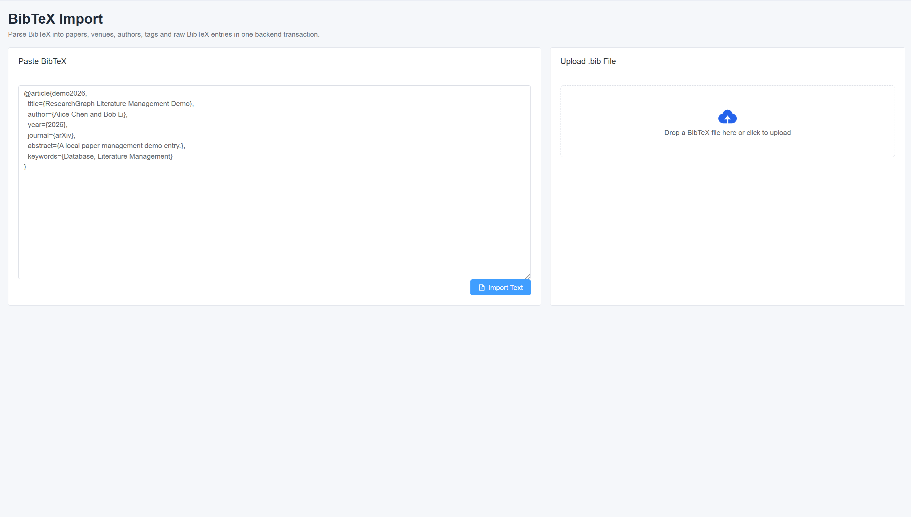

BibTeX 导入适合从 Zotero、Google Scholar、arXiv 或其他文献管理工具迁移已有文献。导入后的论文会进入统一的论文管理流程，继续参与详情展示、笔记关联、AI 分析和知识图谱构建。

## 5. 阅读笔记与概念卡片

ResearchGraph 不只保存论文条目，也关注阅读过程本身。阅读笔记模块允许用户围绕论文记录总结、问题、公式、比较和分析，并通过 wiki link 语法把文本中的关键概念提取为结构化概念节点。

### 5.1 阅读笔记

阅读笔记列表展示已有笔记，并支持搜索和新建。笔记可以关联到具体论文，也可以作为独立研究记录存在。

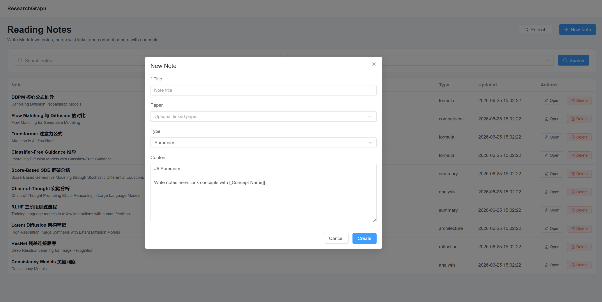

新建笔记时，用户可以指定标题、关联论文、笔记类型和 Markdown 内容。内容中使用 `[[Concept Name]]` 语法即可标记概念。

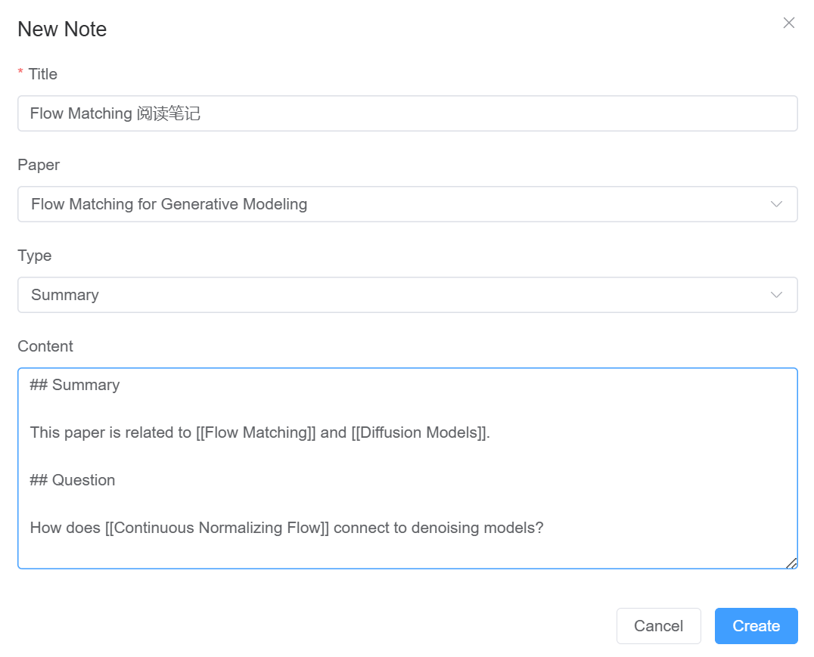

这种设计使阅读笔记不再只是孤立文本，而是能够被解析、索引并连接到概念知识网络中。

### 5.2 Markdown 编辑与双链解析

笔记编辑器支持分屏编辑、纯编辑和预览模式。用户保存笔记后，可以解析其中的概念链接，系统会在右侧展示当前笔记涉及的概念、反向链接和相关笔记。

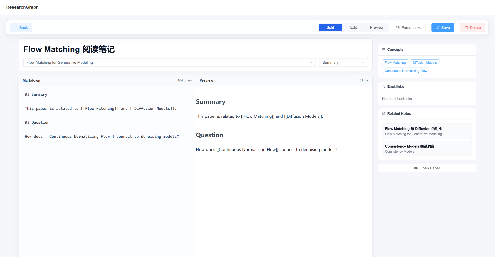

通过概念链接，系统能够发现不同笔记之间的主题联系。例如多篇笔记同时提到 `Diffusion Models` 或 `Flow Matching` 时，这些笔记会自然形成相关笔记集合。

### 5.3 概念卡片

概念卡片模块集中展示由笔记 wiki link 生成的概念。每个概念都有名称、描述和关联笔记数量，用户可以搜索概念并进入详情页。

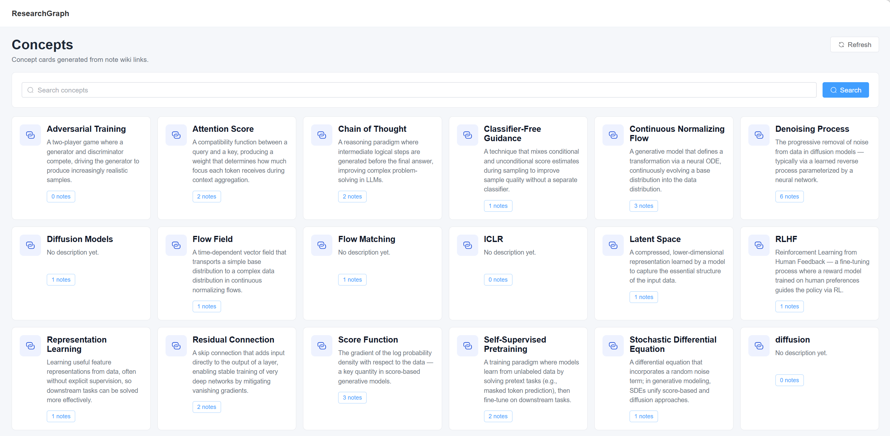

概念详情页展示概念说明以及引用该概念的阅读笔记列表。它相当于一个轻量知识卡片，把分散在笔记中的概念沉淀为可复用的研究知识单元。

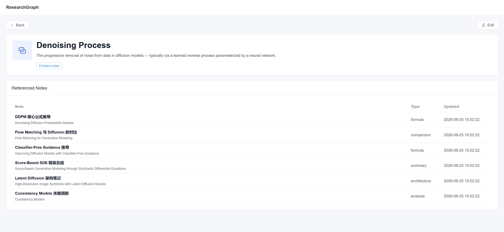

## 6. AI 科研分析

AI 分析模块用于从已有论文和笔记数据中提取辅助信息。当前系统支持自动标签推荐、相似论文推荐、知识图谱关系补边和 Related Work 主题聚类。

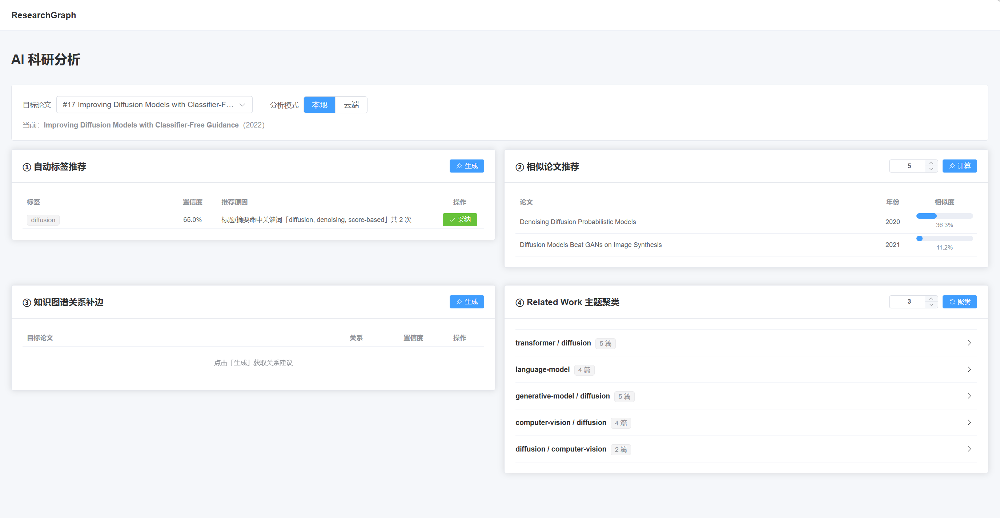

### 6.1 自动标签推荐

系统可以根据论文标题、摘要和内容特征生成标签建议，并给出置信度和推荐原因。AI 只生成建议，不直接修改正式数据；用户采纳后，推荐标签才会写入论文标签关系。

这种机制保留了人工确认环节，避免 AI 结果直接污染正式文献库。

### 6.2 相似论文推荐

相似论文推荐根据论文标题、摘要和相关笔记计算语义相似度，用于帮助用户发现 Related Work。该能力可以辅助研究者从已有文献库中找到主题相近、方法相关或背景相似的论文。

### 6.3 知识图谱关系补边

AI 可以为论文之间生成关系建议，例如 `same_topic`、`method_related`、`possible_baseline`、`improves` 和 `compares_with`。用户确认后，这些关系会进入知识图谱，成为论文节点之间的边。

### 6.4 Related Work 主题聚类

主题聚类将论文库按照研究主题自动分组。对于写论文综述或 Related Work 的场景，聚类结果可以帮助用户快速识别文献群组，形成更清晰的章节组织思路。

## 7. 科研项目与协作

ResearchGraph 将文献阅读从个人管理扩展到团队协作。项目模块用于围绕一个研究主题组织成员和阅读任务，使团队可以共同维护论文、笔记和阅读进度。

### 7.1 项目详情

项目详情页展示项目基本信息、成员列表、成员角色、阅读任务列表和项目知识图谱入口。成员角色包括管理员、普通成员和查看者。

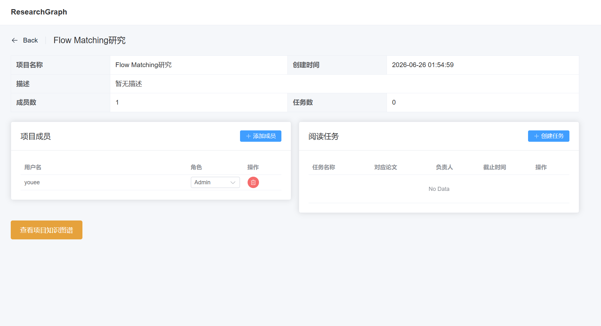

项目模块把论文阅读过程组织成团队工作流：项目成员可以被加入项目，论文可以被分配为阅读任务，任务状态会同步影响 Dashboard 和活动日志。

### 7.2 阅读任务

阅读任务用于把具体论文分配给项目成员。任务记录包括任务名称、论文 ID、任务描述、截止日期和负责人。

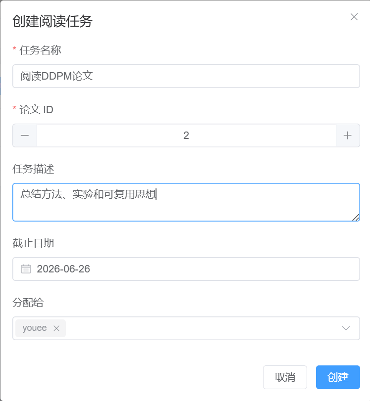

任务创建后，会出现在项目详情和阅读任务列表中，形成从项目到论文、从论文到负责人、从负责人到进度状态的协作链路。

### 7.3 任务列表与状态追踪

任务列表集中展示当前用户或团队的阅读任务。系统支持按状态筛选、修改任务状态、快速完成、评论和删除。

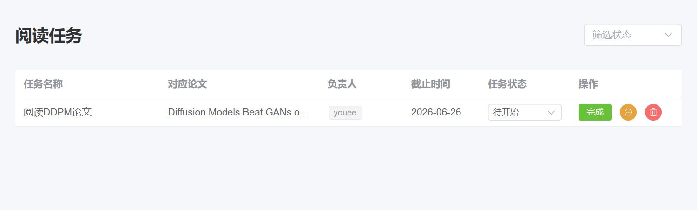

协作动作会回流到 Dashboard。例如创建任务后，待完成任务数和最近活动日志会同步更新。

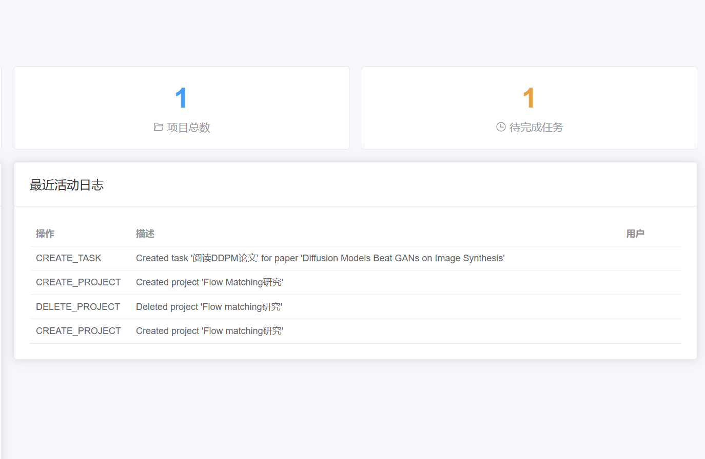

这使 ResearchGraph 不只是文献仓库，也能成为团队阅读计划和科研协作过程的记录系统。

## 8. 知识图谱可视化

知识图谱是 ResearchGraph 的核心展示层。系统把论文、作者、会议/期刊、标签、笔记、概念、项目、用户和 AI 聚类主题统一建模为节点，把作者关系、发表关系、标签关系、笔记关系、概念关系、引用关系、语义相似关系和任务分配关系建模为边。

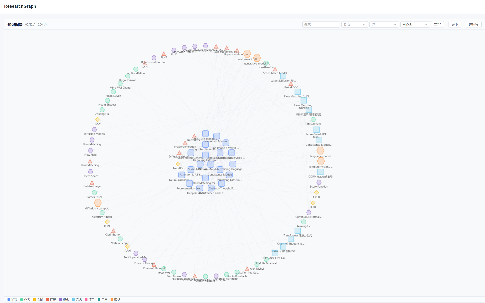

### 8.1 多类型节点与关系

图谱节点类型包括：

- `paper`：论文
- `author`：作者
- `venue`：会议/期刊
- `tag`：标签
- `note`：笔记
- `concept`：概念
- `project`：项目
- `user`：用户
- `cluster`：AI 聚类主题

图谱边类型包括：

- `authored_by`：论文和作者
- `published_in`：论文和会议/期刊
- `has_tag`：论文和标签
- `has_note`：论文和笔记
- `mentions_concept`：笔记和概念
- `links_to`：笔记双链
- `cites`：引用
- `same_topic`：同主题
- `method_related`：方法相关
- `improves`：改进关系
- `compares_with`：对比关系
- `semantic_similar`：语义相似
- `belongs_to`：论文属于 AI 聚类
- `assigned_to`：任务分配给用户

这些节点和边共同表达了一个科研项目中的知识结构、阅读过程和协作关系。

### 8.2 节点高亮与邻居探索

用户点击图谱中的节点后，系统会高亮该节点及其邻居关系，并淡化无关节点。这个交互适合用于查看一篇论文关联了哪些作者、标签、笔记、概念或相似论文。

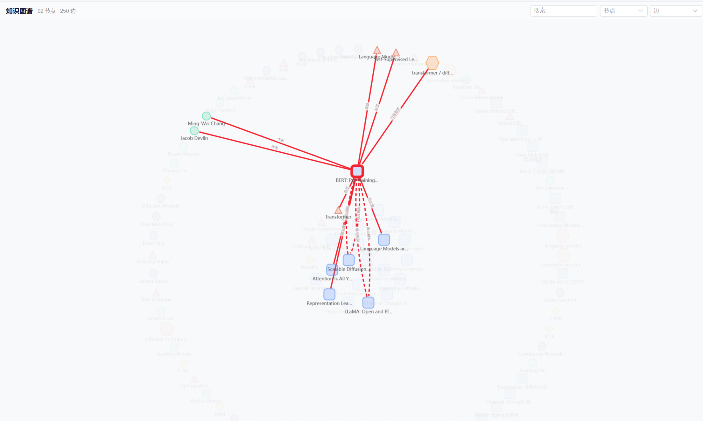

### 8.3 搜索与筛选

图谱支持关键词搜索、节点类型筛选和边类型筛选。用户可以搜索 `Flow`、`Diffusion` 等关键词，也可以只查看论文、概念、标签或特定关系类型。

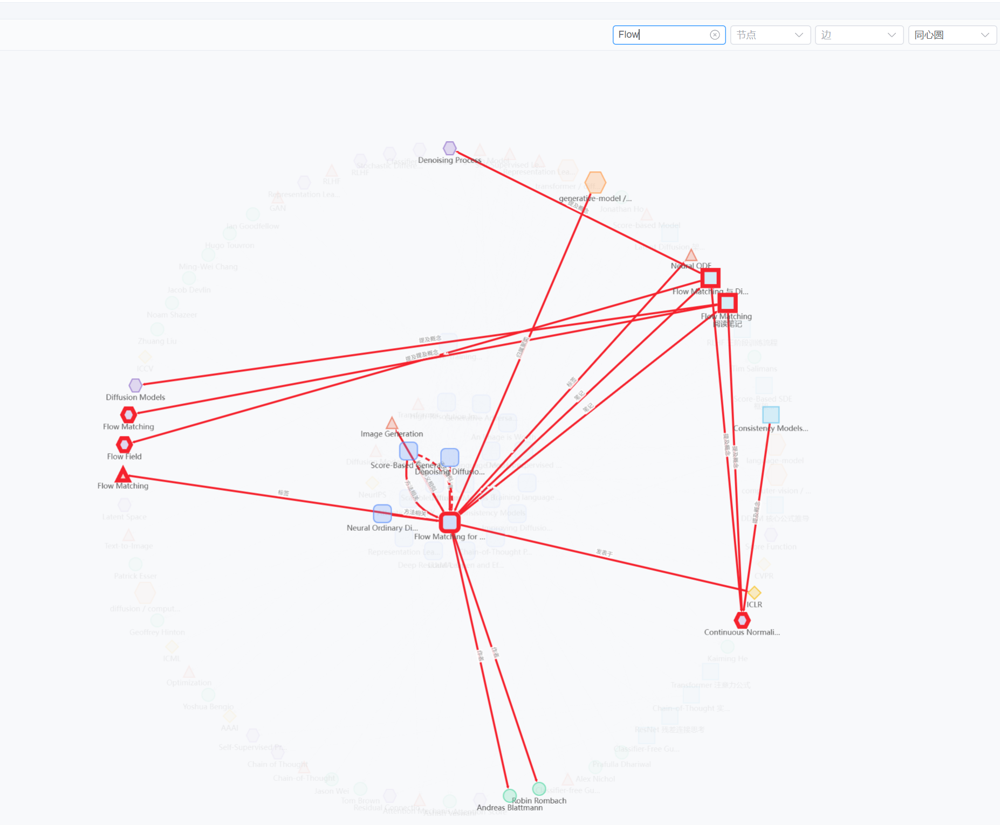

### 8.4 布局切换

知识图谱支持力导向、同心圆、环形和层次等布局。结合节点类型筛选后，用户可以聚焦查看某一类实体之间的关系，例如只查看论文节点之间的引用、语义相似和方法相关关系。

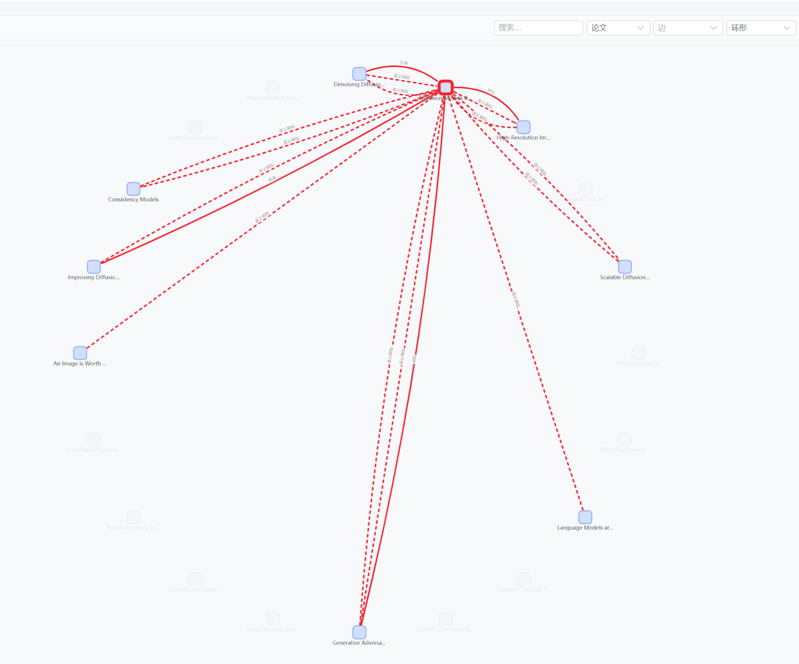

### 8.5 项目图谱

项目详情页提供“查看项目知识图谱”入口。进入项目图谱后，系统可以按项目聚焦，只展示与该项目相关的论文、任务、成员和知识关系。

项目图谱使团队可以从项目视角观察研究材料和阅读任务的组织情况。

## 9. 系统闭环

ResearchGraph 的各模块不是孤立功能，而是围绕同一套研究数据形成闭环：

```text
论文录入 / BibTeX 导入
-> 论文详情与元数据管理
-> 阅读笔记与概念解析
-> AI 标签、相似论文、关系补边和主题聚类
-> 项目协作与阅读任务
-> 知识图谱统一可视化
-> Dashboard 汇总状态与活动
```

这个闭环使系统能够持续积累科研阅读过程中的结构化信息。随着论文、笔记、概念、任务和 AI 分析结果不断增加，ResearchGraph 会从一个文献管理工具逐步成长为一个面向研究团队的知识组织平台。

## 10. 总结

ResearchGraph 当前项目已经覆盖科研文献管理中的多个关键场景：

- 文献录入与 BibTeX 导入降低了论文入库成本。
- 元数据、标签和目录支持文献组织。
- 阅读笔记和概念卡片把阅读过程结构化。
- AI 分析帮助发现标签、相似论文、论文关系和主题聚类。
- 项目与任务模块支持团队阅读协作。
- 知识图谱把所有模块的结果统一呈现。

因此，ResearchGraph 的价值不只是“保存论文”，而是把科研阅读过程中产生的知识和协作信息持续沉淀为可检索、可协作、可分析、可视化的研究知识网络。
